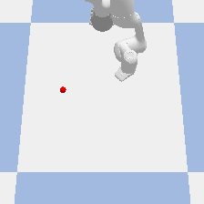

# openVino_Blog

This code repo showcases how one could use Intel's OpenVino to accelerate Deep Reinforcement Learning Training. 
Specifically, this is for RL problems which leverage pre-trained goal classifiers for their reward function. The same 
idea can be applied for RL problems which leverage pre-trained autoencoders for state-space reduction. 

## Reproducing this Repo

### Installing Pre-Requisite Software

Step 1: Git clone this library

Step 2: Install all the python packages (reccomended to this in a python virtual environment)
```console
pip install -r requirements.txt
```

### Training the Agent
Step 3: Run vino_agent_training.py. Note the total exection time + training time outputed at the end

Step 4: Run vino_agent_training.py after enabiling vino=True in line 7. Compare the total execution time and training time to Step 3 (should be lower)

Step 5: Run inference.py to see the trained robot!


## Environment Paramters

```python
env = gym.make('PandaHover-v0', gui=False, vino=False)
```

When intialzing the environment, there are 3 important parameters when initializing the environment

1.gui: whether to run the simulation software with a gui or headless

2.vino: whether to use openVino as the inference engine for the reward classifier network or pytorch

3.device: which device to use as the inference engine (CPU, GPU, MYRIAD). This is only applicable if vino parameter is true

## Enviornment Info 



The goal of our gym environment is for our robot to learn to navigate to the postion of the red spehere using vision. 

The state is the robot' end effector's x,y position.

The action is the robot's dx, dy postion

The reward function is output of the goal classifier network where the Input to the network is an image from the camera
