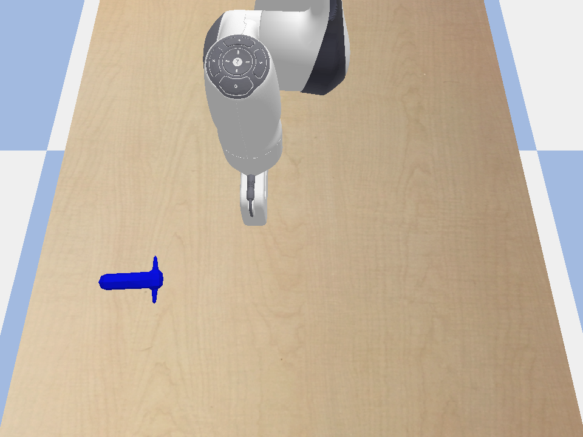

# openVino_Blog

This code repo showcases how one could use Intel® Distribution of OpenVINO™ toolkit to accelerate Deep Reinforcement Learning Training. 
Specifically, this is for RL problems which leverage pre-trained goal classifiers for their reward function. The same 
idea can be applied for RL problems which leverage pre-trained autoencoders for state-space reduction. 

## Reproducing this Repo
This repository was validated using Python 3.8 on Ubuntu 20.04 & Mac OS Catalina 10.15.17
### Installing Pre-Requisite Software

Step 1: Git clone this library

Step 2: Install all the python packages (reccomended to this in a python virtual environment)
```console
pip install -r requirements.txt
```

### Training the Agent
Step 3: Run the training. Note the total time printed at the end
```console
python sac_training.py -g [optional flag if you want to see the robot during its training]
```
Step 4: Run the same training but now using OpenVINO™ toolkit as the inference engine for the reward classifier network. The total time printed at the end should be lower than that of step 3
```console
python sac_training.py -v -g [optional flag if you want to see the robot during its training]
```
Step 5: Run inference.py to see the trained agent! 
```console
python inference.py -v -g
```
## Enviornment Info 



The goal of our gym environment is for our robot to learn to navigate to the postion of the blue object using perception

The state is the robot' end effector's x,y position.

The action is the robot's dx, dy postion

The reward function is output of the goal classifier network where the Input to the network is an image from the camera
