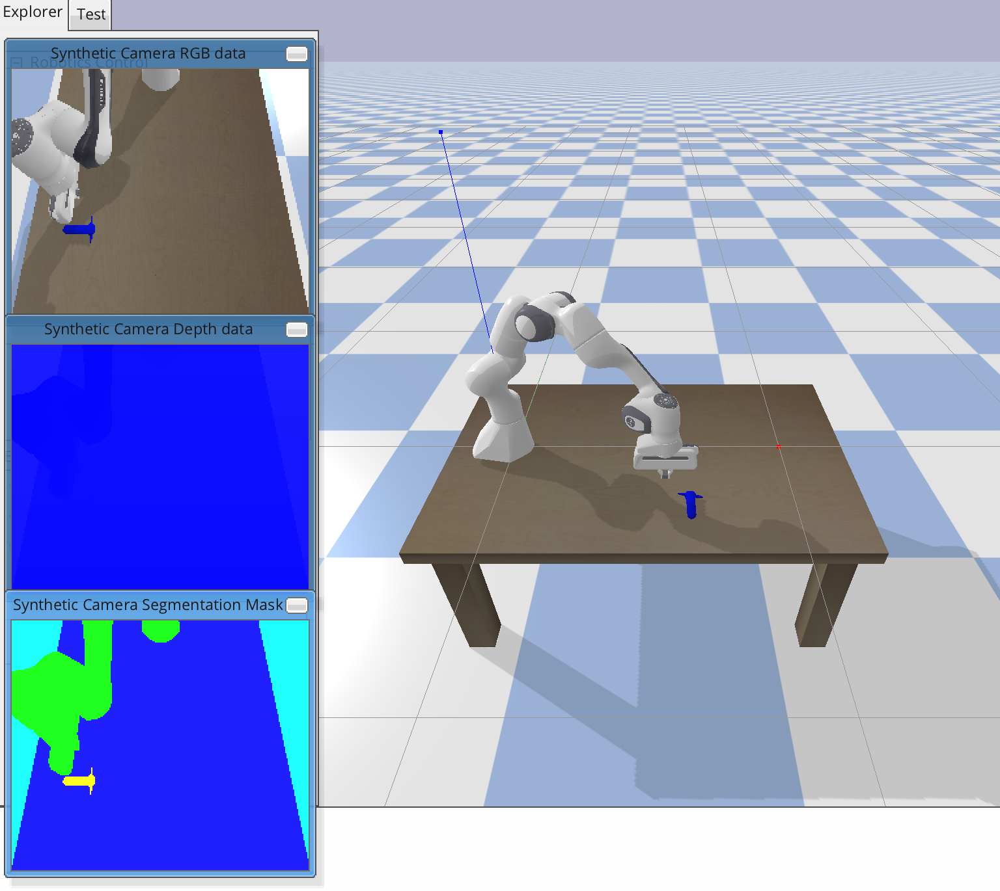

# Accelerating Deep Reinforcement Learning Training with OpenVINO

This code repo showcases how one could use Intel® Distribution of OpenVINO™ toolkit to accelerate Deep Reinforcement Learning (DRL) Training. 
Specifically, this is for DRL problems which leverage pre-trained goal classifiers for their reward function. The same 
idea can be applied for DRL problems which leverage pre-trained autoencoders for state-space reduction. 



We created a Robotics Gym Environment using PyBullet. The goal of our DRL task is to have a robot move toward and hover over the blue object 
based on visual feedback. The observation of is the robot's x-y position. The action is the dx-dy control of the robot's gripper

## Reproducing this Repo
This repository was validated using Python 3.8 on Ubuntu 20.04 & Mac OS Catalina 10.15.17
### Installing Pre-Requisite Software

Step 1: Clone This Repository 
```console
git clone https://github.com/intel/openvino-drl-training-demo
```
Step 2: Install all the python packages (reccomended to this in a python virtual environment)
```console
pip install -r requirements.txt
```
### Training the Agent
Step 3: Run the training. Note the total time printed at the end
```console
python sac_training.py -g [optional flag if you want to see the robot during its training]
```
Step 4: Run the same training but now using OpenVINO™ toolkit as the inference engine for the reward classifier network. The total time printed at the end should be lower than that of step 3
```console
python sac_training.py -ov -g [optional flag if you want to see the robot during its training]
```
Step 5: Run inference.py to see the trained agent! 
```console
python inference.py -ov -g
```

