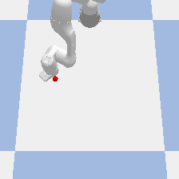

# openVino_Blog

This code repo showcases how one could use Intel's OpenVino to accelerate Deep Reinforcement Learning Training. 
Specifically, this is for RL problems which leverage pre-trained goal classifiers for their reward function. The same 
idea can be applied for RL problems which leverage pre-trained autoencoders for state-space reduction. 

## Installing Pre- Requisite Software
Step 1: Check to see if the correct version of openMPI is installed on your system (should be 2.1.1)

```console
mpirun --version
```

Step 2: install stable baselines dependencies

```console
sudo apt-get update && sudo apt-get install cmake libopenmpi-dev python3-dev zlib1g-dev
```

Step 3: Git clone this library 

Step 4: Install all the python packages (reccomended to this in a python virtual environment)
```console
pip3 install -r requirements.txt
```

Step 5: Install Intel's OpenVino Tool https://docs.openvinotoolkit.org/latest/openvino_docs_install_guides_installing_openvino_apt.html

Step 6: After intstalling openvino, enable it by running 

```console
source /opt/intel/openvino_2021/bin/setupvars.sh
```

## Environment Paramters

```python
env = gym.make('panda_hover-v0', gui=False, vino=False, device='CPU')
```

When intialzing the environment, there are 3 important parameters when initializing the environment

    1. gui: whether to run the simulation software with a gui or headless 
    2. vino: whether to use openVino as the inference engine for the reward classifier network or pytorch
    3. device: which device to use as the inference engine (CPU, GPU, MYRIAD). This is only applicable if vino parameter is true

## Enviornment Info 



The goal of our gym environment is for our robot to learn to navigate to the postion of the red spehere using vision. 

The state is the robot' end effector's x,y position.

Our action is the robot's dx, dy postion

Our reward function is output of the goal classifier network normalized to probabilties from -100 to 0. The Input to the network is from the camera image 
